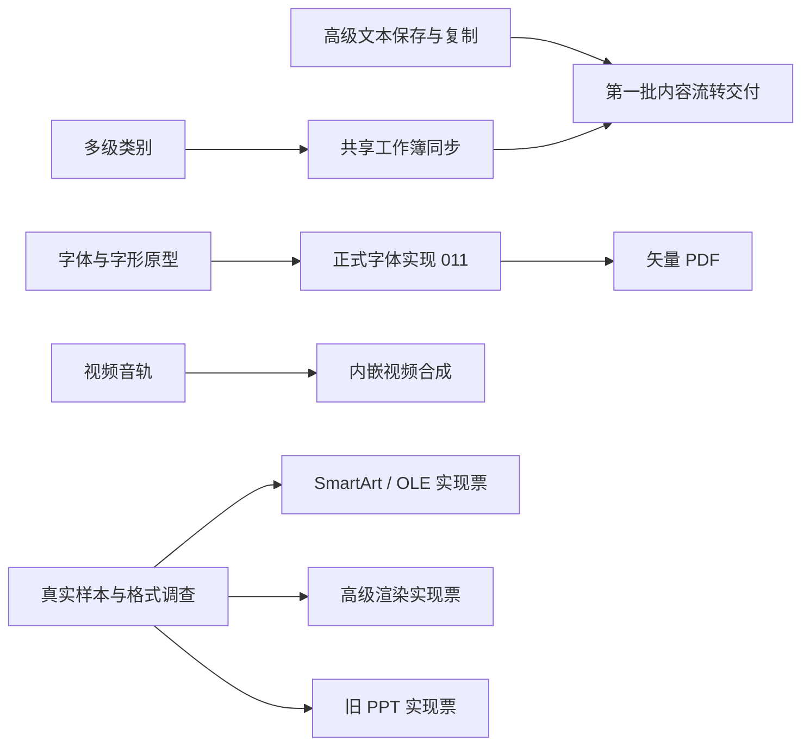

# 下一阶段执行计划

2026-09-09 更新，基线 `45a04a7`。高级文本生成与复制、多级类别及共享图表编辑已完成；正式字体 Provider 与 Cordis 字体工具已验收，矢量 PDF 正在实现。
状态以[任务地图](map.md)及子票为准，当前支持范围仍以[能力矩阵](../../expanded-capabilities.md)为准。

## 目标与顺序

首先让已有内容可靠地跨文稿流转，再补更丰富的交付格式；长尾格式按真实样本选择实现范围。
P0/P1/P2/P3 表示执行优先级，不代表发布版本或工期；无依赖的调查可提前开展。

| 优先级 | 工作 | 用户可见结果 | 启动条件 |
|---|---|---|---|
| P0 | [高级文本生成保存与复制](tickets/001-portable-rich-text.md) | 公式、艺术字及高级文字效果在支持范围内可直接跨文稿复制、保存重开 | 已完成，证据见票据 |
| P0 | [经典图表多级类别编辑](tickets/002-chart-hierarchical-categories.md) | 分组类别可编辑，空槽与重复标签不会被压平 | 已完成，证据见票据 |
| P0 | [共享工作簿与图表同步](tickets/003-shared-chart-workbook.md) | 修改共享数据后，所有关联图表一致更新且可整体撤销 | 已完成，见[支持范围与证据](shared-chart-progress.md) |
| P1 | [字体原型](tickets/004-font-glyph-provider.md) → [正式字体实现](tickets/011-font-glyph-implementation.md) → [矢量 PDF](tickets/005-vector-pdf.md) | 普通文本可选择/搜索，普通图形放大不失真；特殊效果明确回退 | 原型及 011 已完成；PDF 进行中 |
| P2 | [视频音轨](tickets/006-video-audio-track.md) → [内嵌视频合成](tickets/007-video-media-composition.md) | 导出保留音频，再支持视频内容按固定时间轴播放 | 音视频格式及浏览器编码能力可验证 |
| P3 | [SmartArt / OLE 首批范围](tickets/008-native-object-scope.md) | 选定布局/格式获得更完整的内部编辑 | 先取得样本并确定写回与预览方案 |
| P3 | [高级渲染首批范围](tickets/009-render-fidelity-scope.md) | 修复明确的 EMF+、艺术字与三维视觉问题 | 有可复现输入与外部渲染对照 |
| P3 | [旧 PPT 增量写入范围](tickets/010-legacy-ppt-scope.md) | 支持矩阵内增加文字、外观及播放属性的原生保存 | 确认旧格式对应结构及独立读取证据 |

## 依赖与分批交付

| 批次 | 完成判据 | 未通过时 |
|---|---|---|
| 内容流转 | 高级文本与图表的语义、历史及保存闭环通过 | 缩小并公布支持矩阵，保留原子拒绝；不通过取消校验凑覆盖 |
| 矢量 PDF | 字体和文字提取正确；图形结构、视觉对照及导出资源回收通过 | 字体缺失明确提示；既有图片 PDF 保持可用，局部回退说明原因 |
| 音视频 | 声音、画面及时间戳一致，独立播放器可读取 | 不支持的容器/编码明确拒绝；静态封面必须显式选择 |
| 长尾格式 | 调查产出样本、支持矩阵和后续实现票，所选实现逐项验收 | 保留该格式待办或有理由地排除；研究关闭不计为功能完成 |

第一批不等待 PDF、视频或 Windows 验收；每个能力可独立交付。原型结束后才估算相应实现工期。

## 共同完成条件

| 维度 | 必须提供的证据 |
|---|---|
| 编辑语义 | 原生对象保持语义；撤销/重做、冷恢复、字段级协同、只读与失败原子性；不受影响内容保持不变 |
| 文件往返 | 适用的补丁保存、生成保存、源包释放后保存、跨文稿复制及重开；读取器独立验证，不能只用自己读自己 |
| 格式样本 | 能力与确定性固件同时增加；真实样本记录来源/授权/哈希，放外部语料目录，禁止用随机或时间戳污染固件 |
| 渲染对照 | 两条文本路径；独立进程比较 SVG；LibreOffice 或独立 PDF/视频工具对照，记录差异及边界 |
| 产品入口 | SDK 按需 API、必要的框架薄转发、官网完整中英文操作；加载失败、资源缺失、进度及取消均有结果 |
| 架构和成本 | 主入口不静态引入扩展；不放宽现有性能/体积预算；新增入口实测冷加载、耗时与内存，代码按职责拆分 |
| 仓库门禁 | 使用 fnm 的项目 Node；代码改完按顺序运行 `npm run check && npm test && npm run build && npm run verify` |
| 文档状态 | 按实测同步数字、API 与支持矩阵；仅证据齐全的实现标完成，Windows 仍登记为暂缓 |

## 执行状态

[高级文本生成保存与复制](tickets/001-portable-rich-text.md)与
[经典图表多级类别编辑](tickets/002-chart-hierarchical-categories.md)已完成。
[共享工作簿同步](tickets/003-shared-chart-workbook.md)已完成，范围、成本与外观边界见[验收记录](shared-chart-progress.md)。
[字体与字形能力原型](tickets/004-font-glyph-provider.md)已完成，路线及限制见[原型结论](font-glyph-prototype.md)。[011 正式字体实现](tickets/011-font-glyph-implementation.md)也已完成；[005 矢量 PDF](tickets/005-vector-pdf.md)进行中，证据与剩余工作见[实现进度](vector-pdf-implementation.md)。

后续按子票依赖推进；本轮按用户追加要求打包 beta.5，保留所有未完成子票，见[交付说明](../../releases/0.5.0-beta.5.md)。
