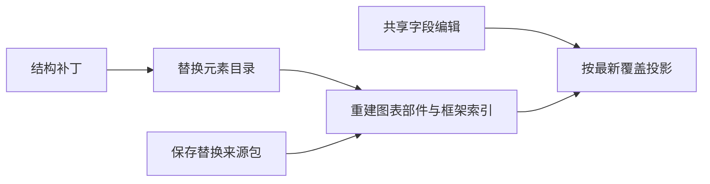

# 共享图表浏览器成本

属于 [003 共享工作簿同步](tickets/003-shared-chart-workbook.md)。混合图实际绘制修复后的发布包测量已完成：三次冷加载、六种规模/场景、每例 25 次编辑及六轮释放全部通过。图像验收和整票状态见[阶段证据](shared-chart-progress.md)。

## 测量口径

| 项目 | 方法 |
|---|---|
| 入口 | 默认从发布包打包；拒绝解析到 `packages/*/src`。`--source` 单独用于定位和源码探测 |
| 冷加载 | 三个独立 Chrome 进程、临时用户目录、关闭缓存；localhost gzip。记录增量下载量、动态 import 总耗时与注册耗时 |
| 场景 | `sample-chart-shared-mixed-records.pptx` 的类别/XY 共同记录；`sample-chart-hierarchy.pptx` 的旧局部覆盖迁移 |
| 规模 | 3、50、200 页；先复制原生页面构造输入，不把准备耗时混入单次编辑 |
| 旧迁移 | 共享扩展注册前，用旧入口改成 619 并新增值为 729 的类别，再复制；激活后检查全部关联框架 |
| 编辑 | 每例 25 次，使用 SDK 挂载首尾两处真实编辑视图；分别记录命令、强制布局及全部框架投影。此项不包含官网其他 Cordis 工具的操作耗时 |
| 复制与保存 | 25 次页面复制/撤销、5 次元素复制/粘贴、3 次保存；每组保留原始样本及中位数、p95、最大值。少量样本的 p95 接近最大值 |
| 正确性 | 计时外校验全部类别层级、系列、X/Y/大小与部件绑定；从副本编辑确认原框架联动，再撤销；保存范围由来源起点、方向和记录数推导 |
| 枚举与身份 | 保存可能改变框架枚举顺序；按完整语义匹配并保留重复数量。新框架的原生派生 ID 不要求等于原件，稳定身份由既有共享图表契约验证 |
| 内存 | CDP `Runtime.getHeapUsage`、显式 GC 及操作边界 `performance.memory`；覆盖 isolate 堆，不是浏览器进程 RSS，也不是同步函数内部的精确峰值 |
| 释放 | 首例释放后，在同一 isolate 重复六轮打开、编辑、保存、释放并 GC；这些循环使用已注册扩展，旧局部迁移仅计首次激活 |
| 失败证据 | 每个操作前后落盘；保留阶段、表达式、已完成样本和页面异常。失败的 CPU profile 仍尝试停止和保存，失败样本不标成功 |

复测命令：

```bash
fnm exec --using=24.3.0 node tooling/measure-chart-shared-browser.mjs
```

`CHART_MEASURE_PAGES`、`CHART_MEASURE_ITERATIONS`、`CHART_MEASURE_SCENARIOS`、`CHART_MEASURE_CYCLES` 可缩小诊断输入。`CHART_MEASURE_PROFILE=1` 关闭压缩并采集调用栈，其耗时不与正式压缩产物混算。

## 根因与修正



初始 200 页调用栈显示 `nativeChartParts`、`sharedCacheSource` 与 `sharedGroupForWorkbook` 在逐框架查询中重复枚举整个文稿。现在按文档、元素目录及来源包建立弱键缓存；图表/关系/工作簿来源字节仍参与依赖校验。普通字段编辑复用原生关系，结构变化立即换代，删除的旧目录无需等下一次图表查询即可回收。

`chart-shared-topology-contract.mjs` 覆盖复制、删除页面与元素、组合/解组、粘贴、撤销/重做、保存后编辑及失败事务；10/30 页预热查询不再枚举整个元素目录。双轴复核另验证了删除并清空历史后的对象回收、预热后冷恢复及释放来源包后的保存。

## 原始证据

| 路径（相对仓库） | 用途 |
|---|---|
| `out/chart-shared-browser/baseline-probe/` | 优化前发布包三次探测、打包元数据及原始 bundle；保持不变 |
| `out/chart-shared-browser/joint-200.cpuprofile` | 优化前源码诊断调用栈，未压缩 |
| `out/chart-shared-browser/cache-probe-v2.json` | 首轮索引优化的源码探测；共同记录完成，旧迁移因测量脚本未识别横向原生图表而失败，状态和已采样值保留 |
| `out/chart-shared/browser-cache-legacy-probe.log` | 修正公式方向校验后的旧迁移源码探测 |
| `out/chart-shared/browser-cache-retention-smoke.log` | 4 页共同记录/旧迁移与重复释放的测量流程验证 |
| `out/chart-shared-browser/dist.json` | Chrome 152.0.7977.83；三次冷加载与六个场景全部 `complete`，每例 25 次编辑、六轮释放，没有页面异常 |
| `out/chart-shared-browser/cache-formal-baseline/` | 未恢复状态改动前的正式发布包测量、元数据和 bundle，保留原结果 |
| `out/chart-shared-browser/unresolved-formal-baseline/` | XY 绘制修复前的正式测量、元数据和 bundle |
| `out/chart-shared/mixed-render-dist-measure.log` | 当前最终产物测量终态成功，保留每例指标 |
| `out/chart-shared/mixed-render-cost-proof.json` | 绑定发布产物、测量报告及实际 bundle 哈希 |
| `out/chart-shared/browser-cache-final-gates.log` | check、全量 test、build、完整 verify 按顺序终态成功；534 项一致性检查，原性能与体积预算不变 |
| `out/chart-shared/unresolved-{source,dist}-proof.json` | 未恢复状态增量每条入口 2,244 项共享断言、45 组迁移契约、118 份原生文件与 388 对渲染验证，绑定源码/发布文件 SHA-256 |
| `out/chart-shared/unresolved-size.json` | 基础入口 81,628 / 25,000 B；共享入口 158,130 / 47,461 B；编辑器入口 280,606 / 69,741 B（原始 / gzip 静态闭包） |
| `out/chart-shared/unresolved-final-gates-v2.log` | 未恢复状态增量四项门禁顺序成功；542 项一致性检查，预算保持 |

本机网络与运行环境均单独记录；这些结果不构成公网延迟承诺或跨机器性能预算。

## 发布产物结果

冷增量下载每次 80,700 B，动态 import 为 9.4 / 9.4 / 9.0 ms，注册均为 0.0 ms。该下载量是测量 SDK 已加载后剩余模块的实际 gzip 字节，包含未加载依赖，不能等同于单个 npm 入口静态闭包。

下表单位为 ms，单元格为「中位数 / p95」。共同记录分别有 3/50/200 个关联框架、237/3,950/15,800 个元素；旧迁移分别有 1/48/198 个关联框架，其余两页图表独立。

| 场景/页数 | 命令 | 全框架投影 | 元素复制 | 粘贴 | 保存 |
|---|---:|---:|---:|---:|---:|
| 共同记录 3 | 4.5 / 18.5 | 1.0 / 1.2 | 4.1 / 12.9 | 13.0 / 18.8 | 5.9 / 8.5 |
| 共同记录 50 | 16.7 / 21.9 | 44.3 / 59.9 | 7.7 / 15.9 | 60.2 / 64.4 | 31.6 / 45.4 |
| 共同记录 200 | 55.0 / 465.5 | 194.0 / 316.4 | 24.2 / 32.9 | 442.0 / 452.2 | 392.4 / 775.1 |
| 旧迁移 3 | 2.9 / 3.8 | 0.0 / 0.0 | 4.7 / 11.5 | 11.2 / 17.1 | 4.2 / 8.4 |
| 旧迁移 50 | 9.3 / 15.8 | 42.4 / 67.0 | 6.5 / 13.2 | 18.0 / 21.8 | 25.2 / 29.9 |
| 旧迁移 200 | 33.9 / 36.1 | 214.6 / 326.8 | 22.3 / 24.2 | 48.0 / 367.7 | 226.0 / 231.7 |

旧迁移的注册阶段为 6.2 / 30.5 / 106.8 ms，随后完整查询为 8.8 / 103.1 / 423.3 ms。共同记录在构造输入前已注册扩展，其完整查询为 0.9 / 102.6 / 589.9 ms。两处 DOM 挂载最大为 18.9 ms。

补齐 XY 图形后，200 页共同记录从旧测量的 9,800 个元素增加到 15,800 个元素；本轮命令中位 55.0 ms、p95 465.5 ms，粘贴中位 442.0 ms。该长尾仍存在，不能宣称大文稿始终即时响应。旧迁移 200 页的粘贴中位为 48.0 ms、p95 367.7 ms。

优化前发布包只采样三次：200 页共同记录全框架投影/复制/粘贴中位数为 2,303.5 / 467.6 / 880.4 ms；旧迁移为 1,775.0 / 74.0 / 102.9 ms。旧测量还遗漏混合图 XY 绘制，不能将工作量不同的前后样本当作严格统计对照。

下表为十进制 MB。采样高水位来自主测操作边界；释放后的堆包含已加载模块及浏览器运行时，六轮结果不等同于长期稳态或无泄漏证明。

| 场景/页数 | 采样高水位 | 活跃文稿 GC 后 | 释放后 GC | 六轮释放后范围 |
|---|---:|---:|---:|---:|
| 共同记录 3 | 94.18 | 15.19 | 14.06 | 14.06–14.66 |
| 共同记录 50 | 222.71 | 33.41 | 26.50 | 26.69–27.38 |
| 共同记录 200 | 300.29 | 56.08 | 31.35 | 31.52–32.14 |
| 旧迁移 3 | 133.68 | 17.91 | 16.94 | 16.94–17.57 |
| 旧迁移 50 | 249.77 | 35.85 | 30.81 | 30.94–31.65 |
| 旧迁移 200 | 298.95 | 48.83 | 31.47 | 31.57–32.18 |

六轮释放后的 ArrayBuffer/backing storage 约 1.96 MB；CDP embedder 堆和全部逐步样本保留在原始 JSON，不与 JavaScript usedSize 混算。
