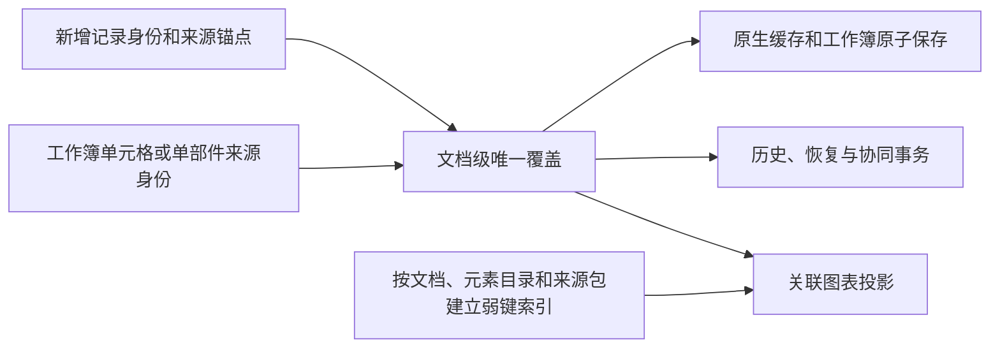

# 共享图表：支持范围与验收

2026-09-09，[任务 003](tickets/003-shared-chart-workbook.md)完成。共享数据、历史、恢复、协同和原生保存闭环已验收；混合图外观仍有[明确差异](mixed-chart-rendering.md)，不承诺与 Office 逐像素相同。

## 支持范围

| 范围 | 行为 |
|---|---|
| 共享来源 | 同 chart part 多框架、同工作簿的重叠/部分重叠/独立区域、多工作表、平面与二/三级类别 |
| 单部件来源 | 纯缓存或独占数据区域从首次编辑起使用文档数据集；同部件的数值别名仍按共享单元格处理 |
| 标量编辑 | 类别层级、系列与 X/Y/气泡大小按稳定身份寻址，一次命令更新所有关联框架；无关单元格不变 |
| 类别与系列结构 | 增删、父组跨度及并发创建；新增类别与新增系列交叉单元格保持；避让已有值、合并格、阵列公式和空格元数据 |
| 原有与新增 XY 点 | 同向、横向、部分范围、共享 X 及同格多维度；删空、保存重开、重建及再次保存保持方向和身份 |
| 混合图独立记录 | 类别与 XY 位于独立区域时可各自增删，包括方向不同的区域 |
| 混合图共同记录 | 类别数值与 XY 维度共用记录轴时，两个入口同步增删与标量；部分视图、空保存重建和并发创建保持共同身份 |
| 实际绘制 | 散点、气泡与图例参与混合图；共轴值域和完整轴视图复用，类别域与 XY 标签分开；几何随 X/Y/大小更新 |
| 复制与粘贴 | 复制页面保留共享来源；元素剪贴板包含未保存编辑，匹配 OPC 闭包的目标可粘贴，派生图形不成为独立交互对象 |
| 历史与协同 | 整体撤销/重做、冷恢复、字段级 LWW、乱序/重复消息和失败回滚；删除原页及中间副本后仍可恢复 |
| 旧覆盖迁移 | 可证明来源的旧覆盖自动移入文档数据；可选 `collab/migration` 按原 set/del 与 stamp 裁决，复制继承可证明版本 |
| 无法恢复的旧数据 | 保留原数据，查询和画布明确显示未恢复；不返回伪数据表，命令、投影和保存拒绝，失败保存不清除恢复日志 |
| 按需产品入口 | `edit-core/chart-shared`，`editor` / `react` / `vue` 薄转发；官网中英文面板、恢复首屏与复制保存流程接入同一 Cordis 应用 |

## 支持边界

| 边界 | 处理 |
|---|---|
| 外部工作簿、不可解释的公式、损坏依赖 | 返回具体绑定原因，原子拒绝不安全写入 |
| 结构方向有歧义 | 单个 XY 系列维度跨表、异向或起点不一致时，不推测增删含义；这不等于所有多表数据都只读 |
| 区域或并发冲突 | 新增命令冲突时不改模型；并发产生的冲突保留覆盖，统一只读并拒绝保存，补齐/撤回后可恢复 |
| 旧模型缺证据 | 缺来源身份、缺日志、身份碰撞、未知操作及同 stamp 矛盾明确拒绝，不猜测丢失版本；见[迁移范围](legacy-chart-migration.md)与[版本协议](versioned-chart-migration.md) |
| 任意跨稿复杂部件 | 元素剪贴板仍要求目标已有匹配 OPC 闭包；旧资源原子拒绝，不向空白文稿自动迁移任意复杂部件 |
| 图表外观 | 自动轴域、同侧轴标签布局、气泡半径和既有父级轴呈现仍有差异；见[图像实测](mixed-chart-rendering.md)及[009 后续调查](tickets/009-render-fidelity-scope.md) |
| Office 差异 | LibreOffice 会省略显式空字符串，部分情况下删除空 XY 系列；原生文件与编辑器仍保留。Windows PowerPoint 真机按原决定暂缓 |

## 模型与成本



来源字节、关系和工作簿字节参与缓存失效。普通字段编辑复用依赖索引，结构补丁换代、保存替换来源包后重建；文档、目录及来源包均为弱键。未挂载图表和空系列公式仍参与区域所有权。

| 发布入口 | 原始 / gzip 静态闭包 |
|---|---:|
| `core` | 383,223 / 134,792 B |
| `core/chart-edit` | 82,459 / 25,716 B |
| 基础 `edit-core/chart` | 81,628 / 25,000 B |
| `edit-core/chart-shared` | 158,130 / 47,461 B |
| 编辑器主入口 | 280,606 / 69,741 B |

全部相对静态分块计入，peer 不重复计入；原预算不变。图表与 core 产物复用保留纯调用注解的构建压缩，未引入 SDK 运行时依赖。实测见 `out/chart-shared/mixed-render-size.json`。

最终发布包三次冷加载、3/50/200 页的共同记录和旧迁移场景、每例 25 次编辑及六轮释放均完成。冷增量下载 80,700 B；200 页共同记录命令中位 55.0 ms、p95 465.5 ms，保存中位 392.4 ms、p95 775.1 ms。大文稿长尾仍存在，完整结果及内存采样限制见[浏览器成本](shared-chart-browser-cost.md)。

## 最终证据

| 验收 | 结果 |
|---|---|
| 源码与发布包 | 每条入口 2,320 项共享断言、45 组旧迁移、118 份独立读取的原生文件 |
| 保存渲染 | 每条入口 406 对补丁/生成 SVG，仅去除非绘制 `data-el` 属性；两条文字路径覆盖，源码与发布包之间也逐字节一致 |
| 旧结构矩阵 | 十四种散点/气泡/类别形态 × 两种接收时机；每条入口 56 份产物由独立读取器验证，见[旧结构迁移](legacy-chart-migration.md) |
| 产品 | 真实 Chrome/IndexedDB、恢复首屏、Cordis 生命周期、中英文编辑、复制、撤销/重做及保存重开通过 |
| 固件 | 157 份物理固件连续生成两次逐字节一致；全仓编辑等价使用 150 份样本、984 对指纹；186 个渲染快照通过 |
| 外部图像 | 12 份原始/保存产物经 LibreOffice 实际 PNG 对照；XY 遗漏消除，剩余外观差异与 SSIM 下降原样公开 |
| 仓库门禁 | check、全量 test、build 顺序通过；首次 verify 仅八处旧数字失败，按实测修正后完整 verify 通过；文档收口后的 553 项一致性检查及发布包专项通过 |
| 复核 | Standards 与 Spec 最终无剩余 P1/P2；轴绘制、留白与映射有 4,436 组基线等价输入 |

最终日志与哈希证据位于 `out/chart-shared/`：`mixed-render-final-gates.log`、`mixed-render-final-verify.log`、`mixed-render-docs-final-verify.log`、`mixed-render-{source,dist}-proof.json`、`mixed-render-cost-proof.json`、`mixed-render-visual-proof.json`。前序证据保留在同目录，不用新结果覆盖历史失败。

```bash
fnm exec --using=24.3.0 npm run test:chart-shared
fnm exec --using=24.3.0 npm run test:chart-shared:dist
fnm exec --using=24.3.0 node tooling/measure-chart-shared-browser.mjs
fnm exec --using=24.3.0 node tooling/measure-chart-shared-visual.mjs
```

下一张为[字体与字形能力原型](tickets/004-font-glyph-provider.md)。本阶段地图仍未完成，本票未提交或发布版本。
