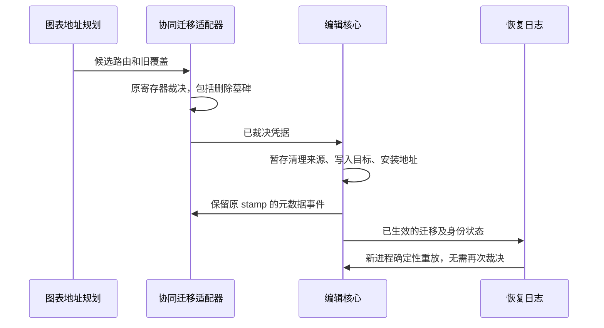

# 带原始时钟的旧图表迁移

属于 [003](tickets/003-shared-chart-workbook.md)，本文件描述正在实现的协议，不表示已交付。

| 层 | 职责 | 不承担 |
|---|---|---|
| `chart-shared` | 给旧字段提供精确目标地址、记录身份及领域校验 | 不读取协同适配器私有时钟 |
| 可选 `collab/migration` | 同一模型版本下读取原寄存器与原操作，裁决 `set/del`，产生迁移凭据 | 不借迁移时间、复制时间或零时钟伪造字段版本 |
| `edit-core` | 暂存并执行已裁决的纯数据迁移，持久化凭据，重放历史与恢复 | 不维护另一套持续更新的协同时钟 |

不可变地址只描述路由。可变迁移结果与路由分开保存；凭据携带胜出原操作、原 stamp、规范目标及参与迁移的来源地址。持续版本真值仍由协同寄存器持有。

| 边界 | 要求 |
|---|---|
| 自动迁移 | 不推进用户历史、脏状态或字段时钟；下一条正常消息可以携带尚未宣布的迁移凭据 |
| 远端凭据 | 先与本地原寄存器重新裁决，再执行本地结果；不能直接覆盖接收端已获胜的更晚操作 |
| 同时迁移 | 双方路由相同，凭据中的当前赢家可以不同；交换后按原 stamp 收敛 |
| 冷恢复 | 先 `Editor(recoveryFrames)`、后 `bind(checkpoint)` 的既有顺序可继续使用；凭据参与恢复，checkpoint 保留原版本 |
| 删除 | `del` 是带版本的操作，不能因没有可遍历的值而丢掉它 |
| 无版本复制覆盖 | 只有复制时来源证据充分才继承原字段版本；当前父字段版本或复制消息版本不能替代它 |
| 失败 | 领域校验、地址冲突、日志上限或版本不一致均在暂存阶段拒绝；模型、寄存器、历史和恢复序号全部保持 |
| 按需成本 | 裁决和协同会话适配从可选子路径加载，保留现有默认入口预算 |

验收需覆盖不同旧所有者、新旧并存、新删压旧值、迟到旧删、复制后来源改变、两端不同赢家先迁移再交换、无 collab 冷恢复和失败批次回滚。已有无冲突迁移契约必须继续通过。

## 已实现的前置能力

`@web-ppt/collab/migration` 公开与默认入口同签名的 `bindCollaboration`，在同一会话上记录原操作。

| 项目 | 当前行为 |
|---|---|
| 版本真值 | 使用现有寄存器对象及原 stamp；可选 `checkpoint.extensionOperations` 只附加同键的标量 `set/del` |
| 删除与恢复 | 来源元素/页面删除仍保留原 set；真实字段删除保留 del；旧 checkpoint 缺少证据时保持未知 |
| 回滚 | 证据通过原寄存器对象关联，失败恢复旧寄存器时同步恢复；坏延迟组单独隔离 |
| 地址变化 | 原路径和 ID 引用值同时规范化；透明旧键无证据时沿用基础兼容规则 |
| 输入与快照 | 拒绝继承属性、访问器、符号和非标量操作；公开快照与内部证据隔离 |
| 按需入口 | 默认入口不加载证据实现，启用后不另建会话或时钟；同步 provider 首批消息也参与记录 |

核心已增加下述凭据执行协议。已接通图表自动生成凭据、原版本冲突裁决、协同运输及远端再次裁决；本轮补齐可证明的复制来源版本继承。有界旧结构矩阵及歧义拒绝状态见[旧覆盖迁移](legacy-chart-migration.md)，003 整体验收见[共享图表进度](shared-chart-progress.md)。

此前原操作证据阶段的二十七组源码/发布包契约及完整四项门禁通过，记录为 `out/chart-shared/versioned-evidence-final-gates-v2.log`。构建体积按每个相对静态文件 gzip 后求和，peer 另计，实测见 `out/chart-shared/versioned-evidence-size.json`：

| 入口 | 原始字节 | gzip 字节 |
|---|---:|---:|
| 默认 `collab` 及静态分块 | 43,438 | 12,398 |
| 可选 `collab/migration` 及静态分块 | 46,693 | 13,552 |
| 已加载默认入口后再加载可选入口的增量 | 4,428 | 1,728 |

该阶段默认入口的独立薄包测试为 14,304 B gzip，低于原有 14 KiB 预算；这是重新打包后的测试口径，与上表逐文件发布口径不同。

## 核心凭据执行

`extensions['edit-migrations'][JSON.stringify(target)]` 保存已裁决的 JSON 标量。路由仍在 `edit-addresses` 中保持不可变；新的裁决可以更新同一目标的凭据。编辑核心只执行传入结果，不比较 stamp 或生成版本。

| 凭据内容 | 作用 |
|---|---|
| `version: 1` 与 `routes` | 限定参与来源与同一规范目标，保留身份映射 |
| `inputs` | 保留参与来源的原路径、标量 set/del 及可选原 stamp；缺版本保持未知 |
| `winners` | 指向 inputs 的索引，每个规范字段恰有一个赢家，不复制第二份赢家值 |

| 已实现边界 | 验证 |
|---|---|
| 清源与落模 | 当前来源叶必须被完整覆盖；先校验目标与赢家的容器兼容性，再于隔离模型清源、安装地址和执行领域校验 |
| 批次与日志 | 核心严格执行显式补丁顺序；提交前准备日志声明，未来凭据不能提前路由历史字段；后续字段失败回滚整批 |
| 幂等与删除 | 相同凭据不覆盖后来的编辑；新凭据的删除赢家可清除旧值并冷恢复 |
| 模型完整性 | 会话与保存入口校验已存凭据及其安装地址；父子赢家冲突、损坏凭据和指向协议命名空间的地址均拒绝 |
| 协同边界 | 默认入口拒绝远端凭据；可选入口在接收端重新裁决，输入原时钟不能超出运输因果水位；凭据不获得运输时钟寄存器 |
| 规模成本 | 每个凭据只构造自己参与的路由表；1,200 个已存凭据校验独立复测约 7.82 ms，修复前约 184.03 ms |

此前核心凭据阶段新增 `core-receipt`、`core-receipt-paths`、`core-receipt-transport`、`core-receipt-deferred` 四组独立进程契约，覆盖纯核心执行和接收边界。当时三十一组源码/发布包专项及四项完整门禁均通过，日志为 `out/chart-shared/migration-receipt-final-gates-v2.log`；该记录早于下节端到端冲突迁移，上节二十七组及体积记录则属于原操作证据阶段。

核心凭据阶段构建实测见 `out/chart-shared/migration-receipt-size.json`，仍按相对静态文件逐个 gzip 后求和：默认 collab 为 43,474 B / gzip 12,429 B，可选迁移入口为 46,764 B / gzip 13,582 B，已加载默认入口后的迁移增量为 4,463 B / gzip 1,725 B。独立薄包契约为 14,323 B gzip，仍低于原有 14 KiB 预算；edit-core 主入口及静态分块为 187,922 B gzip。

## 冲突裁决阶段

独立进程先只加载 core、edit-core 与可选协同入口，恢复旧协议的两笔字段写入，再加载 `chart-shared`：同一图表部件的两个框架分别持有 `111@{clock:1,replicaId:b}` 与 `777@{clock:2,replicaId:b}`。输入操作和 stamp 来自真实编辑消息；原生身份按复制框架精确映射，模型不直接改写。加载后两框架均为 777，可编辑、撤销、重做、保存重开和无协同冷恢复。

| 新增契约 | 已验证行为 |
|---|---|
| `versioned-conflict` | 111/777 原版本冲突自动迁移；保存状态、历史与身份不推进；后续编辑及冷恢复一致 |
| `conflict-evidence` | 未知删除和同 stamp 的 set/del 矛盾保持原树与只读；更晚原操作按规范地址补齐证据；合法无关地址前缀不能绕过迁移否决 |
| `remote-migration` | 两端先得到 777/888 后交换；本地更晚 1001 保留；乱序消费重新裁决，普通获胜字段更新脏状态及撤销历史；坏批次回滚；恢复帧与 checkpoint 可重建 |
| `migration-recovery-order` | 保留无关目标 foo=99；field→receipt、receipt→field 及晚订阅日志分别与实时结果一致 |
| `migration-resolver-disposal` | A/B 乱序释放、相同函数重复注册及重复释放都不复活已释放实例 |

三十六组源码和发布包专项通过，两份独立复核均无剩余 P1/P2。本轮 check / 全量 test / build 顺序通过，首次 verify 只发现旧体积数字；按实测同步后完整 verify 通过，含 532 项一致性检查。日志为 `out/chart-shared/versioned-conflict-final-gates-v2.log` 与 `versioned-conflict-final-verify.log`；1,514 个源码输入在前三项门禁前后哈希一致，其后只同步文档及官网静态体积文字。旧输入失败探针仍保留于 `out/chart-shared/ppt-versioned-conflict-{input,cold-probe}.json`，它们属于修复前证据。

恢复只给隔离暂存模型授予历史来源校验上下文：保留原字段领域校验，跳过新共享所有权要求和提前修剪。实际地址和赢家在凭据原位置生效，成功提交不携带该上下文。可选裁决将明确的计划结果传入基础接收器，暂存地址后也不会重新规划并绕过否决。

该阶段默认薄包实测 14,333 B gzip，仍低于原有 14 KiB 预算。远端路由按 Map 聚合，独立复核 100/300/600/1,200 条约为 2.1/4.7/8.1/16.9 ms；这是局部成本证据，不代替整票浏览器验收。

该阶段发布构建实测见 `out/chart-shared/versioned-conflict-size.json`，按相对静态文件逐个 gzip 后求和、peer 另计：

| 入口 | 原始字节 | gzip 字节 |
|---|---:|---:|
| 默认 `collab` 及静态分块 | 43,544 | 12,467 |
| 可选 `collab/migration` 及静态分块 | 54,679 | 16,127 |
| 已加载默认入口后的迁移增量 | 12,308 | 4,234 |
| 基础 `edit-core/chart` 及静态分块 | 81,676 | 24,995 |
| `edit-core/chart-shared` 及静态分块 | 149,628 | 45,229 |

`edit-core` 默认入口及静态分块为 188,489 B gzip，`editor` 为 280,606 B / gzip 69,741 B；原有入口预算未放宽。

独立 Python ZIP/XML 读取 `versioned-conflict-native.pptx`：原页与复制页仍共同引用 `chart1.xml`，缓存及内嵌工作簿 B2 均为 999；其他单元格、共享字符串节点及无关图表/工作簿部件保持。保存器清除共享字符串表的可选 count 缓存，节点与索引次序不变。报告及产物 SHA-256 见 `out/chart-shared/versioned-conflict-native.json`；该文件覆盖本轮标量冲突旅程，不替代完整迁移矩阵。

## 复制原版本继承

复制命令在实际执行位置冻结可证明的原操作，正向和逆向页面快照共用该结果。复制后的父字段变化不会改写这份证据；复制本身不生成新的字段版本。

| 快照字段 | 语义 |
|---|---|
| `copySources` | 副本元素 → 直接来源元素；连续复制不跳过中间副本读取最初原件 |
| `extensionCopies` | JSON 标量中的原路径、set/del、值、原 stamp；必须与快照叶一致 |
| 恢复时的自身来源 | 副本后来收到实际字段更新后，结构历史保存目标自身的获胜操作；普通删页恢复也适用 |
| 缺少证据 | 不从当前模型、后来来源寄存器或复制消息时钟补造版本 |

| 边界 | 实现 |
|---|---|
| 同批先写再复制 | 较早的真实字段写入可以提供本批 stamp；失败事务不遗留证据或身份消耗 |
| 副本收到新值后重做 | 提交前准备不可变历史快照，保留页面结构意图；字段应用复用核心容器/标量语义 |
| 另一副本删除并恢复旧快照 | 接收端以目标已知的原操作重基纯快照；在延迟消费时重新读取获胜版本，已有共享路由不回填局部数据 |
| 接收端已加载共享实现 | 预演实际接受的结构和页序，将嵌在快照中的旧覆盖纳入同批裁决 |
| 缺序与冷恢复 | 消费时使用最新本地值重新裁决；提前收到的身份号段不意味着页面 part 已经存在 |
| 无效输入 | 原 stamp 不得带额外字段或超过运输因果水位；失败批次可用相同序号纠正重试 |
| 同 stamp 矛盾 | 原协议没有批内字段序位，不能据运输顺序猜赢家，继续保留只读 |

公开局部图表入口在复制形成多个框架后拒绝继续局部写入；“写入 → 复制 → 再写入”事务完整回滚。共享入口的文档数据直接联动所有框架。外部拼出的同 stamp 不同值不能视为有充分证据的历史，这一边界不引入新的时钟体系。

复制专项包括原字段变化、来源删除、连续复制、真实删除墓碑、复制与普通删页的非空撤销重做、跨副本恢复、派生失败回滚、两种加载顺序、缺序后再编辑、冷恢复及原生保存重开。四十二组源码和发布包专项均通过，两份独立复核无剩余 P1/P2；完整 check / test / build / verify 顺序通过，日志为 `out/chart-shared/versioned-copy-final-gates.log`。前节日志属于此前增量。

复制阶段发布构建实测为 `out/chart-shared/versioned-copy-size.json`，仍按相对静态文件逐个 gzip 后求和、peer 另计：

| 入口 | 原始字节 | gzip 字节 |
|---|---:|---:|
| `edit-core` 及静态分块 | 714,358 | 190,152 |
| 默认 `collab` 及静态分块 | 43,586 | 12,489 |
| 可选 `collab/migration` 及静态分块 | 59,402 | 17,402 |
| 已加载默认入口后的迁移增量 | 16,989 | 5,488 |

默认协同薄包仍为 14,333 B gzip；基础图表为 81,676 B / gzip 24,995 B，editor 为 280,606 B / gzip 69,741 B，原有预算均未放宽。

独立 ZIP/XML 读取 `out/chart-shared/versioned-copy-native.pptx`：先迁移、迟到复制及缺序期间继续编辑后，原页与复制页仍共用 chart1；缓存与工作簿 B2 均为 888，其他单元格和无关图表/工作簿部件保持。读取器与 SHA-256 报告见同名前缀的 `.py` 与 `.json`。
