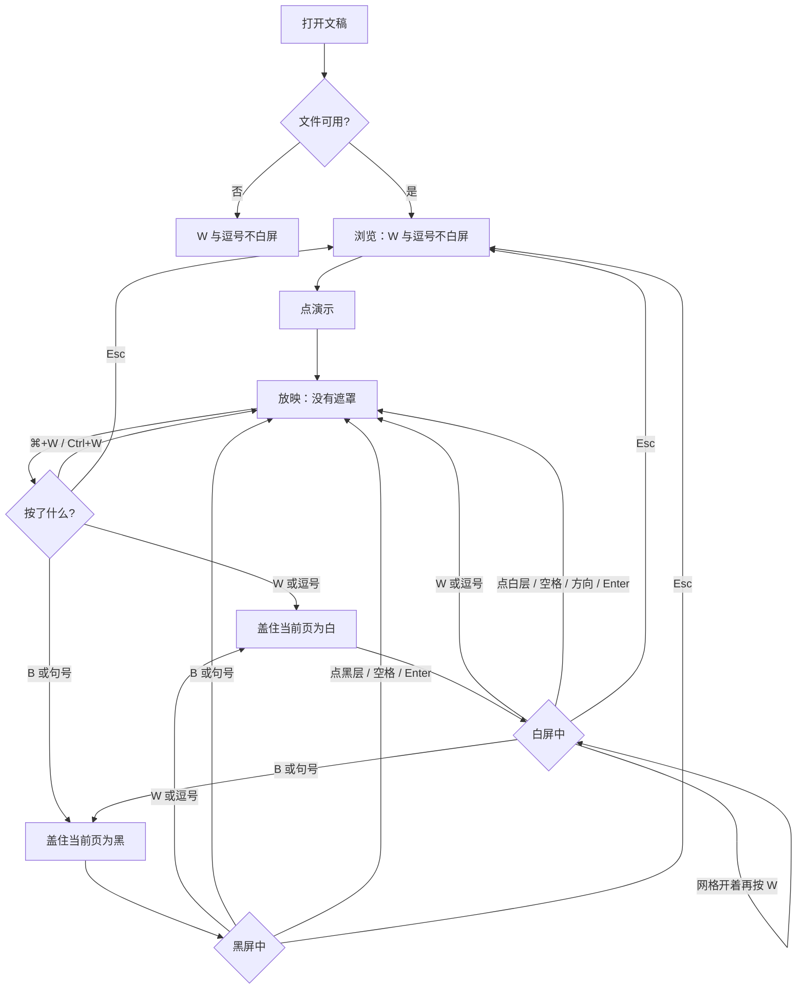
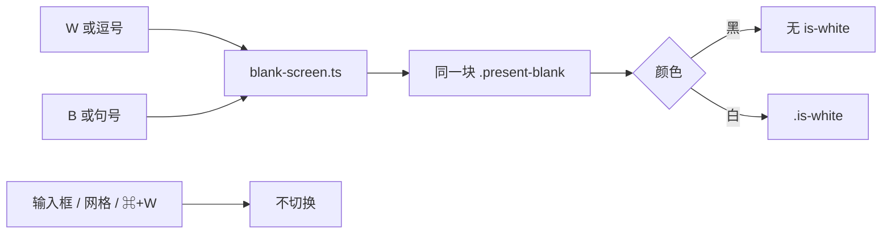

# 放映白屏：W 与逗号

> 第二十八轮持续性迭代。只做这一件事：官网首页 Demo、样本预览、独立查看器在**放映中**，不带修饰键的 W 或逗号盖住当前页成白屏；再按同一组键回来。黑屏仍是 B 与句号。浏览态不能误白屏。

---

## 1. 目标与用户

| 项 | 内容 |
|---|---|
| 用户 | 在浏览器里打开 `.pptx` / `.ppt` 后点「演示」的人：亮房间里停讲，不想给观众留一块像投影灭了的黑。不装 Office，文件不出设备。 |
| 要解决的问题 | 第五轮黑屏、第二十七轮句号都只盖黑。Microsoft 桌面放映表的下一行是白屏，Google 现行放映节把 `w` 单独写成一行。逗号现在什么都不做。 |
| 成功标准 | 只在放映中、没有 Ctrl / ⌘ / Alt：W 或逗号开关白屏，页码不变。浏览态、搜索框、网格开着、⌘+W 不白。黑屏 B / 句号仍在。点白层、空格、方向键、放映 Enter 只恢复当前页。Esc 离开并清掉这层。 |

不为谁做：不在这一轮做数字+Enter、激光笔、浏览态白屏、把白屏做成第二颗控制条按钮、改 `render/` 或 core。

---

## 2. 用户场景与流程

主路径：打开文稿 → 点「演示」→ 按 W 或逗号 → 观众只看到白 → 再按 W 或逗号 → 还是这一页。浏览时按 W 或逗号，画面不动。

| 分支 | 行为 |
|---|---|
| 空状态 | 未打开或打开失败：没有放映，W 与逗号不造遮罩。 |
| 失败 | 全屏被拒：仍在放映，W 与逗号照常。输入框里的字留给输入。 |
| 取消 | 浏览态、网格开着、带 Ctrl / ⌘ / Alt 的 W 或逗号：不白屏、不翻页、不关网格。⌘+W 仍是浏览器关标签，这里不拦截。 |
| 返回 | 再按同一色的键、点遮罩、空格、方向键、Enter：回到当前页，不翻页。按另一色是换成那一色，不是直接取消。 |
| 恢复 | Esc / 退出清掉遮罩。退出后再按 W 不白。换文件、从网格点到某一页：先清遮罩再给那一页。 |

---

## 3. 范围

| 必须做 | 不做 |
|---|---|
| 首页 Demo、样本预览、独立查看器共用现有遮罩，多一个白色 | 数字后按 Enter 跳页 |
| 放映中不带修饰键的 W、Shift+W、逗号开关白屏 | 浏览态白屏 |
| 与黑屏互斥：同一层只有一种颜色 | 激光笔、第二颗 W 按钮 |
| 搜索框、网格、⌘+W、放映 Enter 不抢错 | 任意键都恢复 |
| 点层、空格、方向、Enter 只恢复；Esc 离开并清层 | 改 `render/`、推进发布包 |

---

## 4. 调研与缺口

本轮打开并读完的原始页面（不是搜索摘要）。日期 2026-09-22。

| 来源 | 用户实际怎么用 | 对本仓库的含义 |
|---|---|---|
| [Use keyboard shortcuts to deliver PowerPoint presentations](https://support.microsoft.com/en-us/accessibility/powerpoint/use-keyboard-shortcuts-to-deliver-powerpoint-presentations) · Windows `tabpanel_1_windows` | 黑屏一行：**B、Period (.)**。下一行：**Display a blank white slide, or return to the presentation from a blank white slide. W、Comma (,)**。指定页：**Type the slide number, then press Enter**。前进里也有 **Enter**。结束是 **Esc**。 | 白屏和黑屏是相邻两行，各自都能盖上和回来。逗号是白屏别名，不是黑屏。Enter 既是前进，又是输完页码后的确认。 |
| 同上 · macOS `tabpanel_1_macos` | 白屏：**W、Shift+W、Comma (,)**。黑屏：**B、Shift+B、Period (.)**。指定页：**Type the slide number, then press Return**。结束：**Esc、Hyphen (-)、⌘+Period (.)**。 | Shift+W 的字符已是 `W`。单独的逗号是白屏。⌘+. 仍是结束，不能拿来白屏或黑屏。 |
| 同上 · Web `tabpanel_1_web` | 只有开始、前进、后退、**Esc**。没有 W，没有逗号，没有指定页。 | Web 栏没写白屏，不推翻桌面表。本仓库的放映快捷键已经按桌面表补过句号。 |
| [Present slides · Computer](https://support.google.com/docs/answer/1696787?hl=en&co=GENIE.Platform%3DDesktop) · 展开 `Present mode keyboard shortcuts` | PC、Mac、Chrome 三张表同一组：**Show a blank black slide → `b`**，回来 **Press any key**；**Show a blank white slide → `w`**，回来 **Press any key**。指定页：**Number followed by Enter**（例子是 7 再 Enter）。没有句号，也没有逗号。 | `w` 是独立一行，不是 `b` 的别名。三张表都有白屏，也都有数字+Enter。 |

对照本仓库：

| 表面 | 已有 | 缺口 |
|---|---|---|
| 官网首页 / 样本 / 查看器 | 放映中 B 与句号黑屏；点层、空格、Enter 只恢复；Esc 清层 | 没有白屏。逗号被第二十七轮故意留空 |
| 网格 | G 与「全部」能跳到任意页 | 不能代替白屏。数字+Enter 仍没有，但跳页本身已经有 |
| 查看器 Enter | 放映中 Enter 播完本页剩余动画，不翻页 | 不能拿来当白屏键 |
| 官网 Enter | 放映中 Enter 与空格一样前进 | 白屏时如果放行，会在看不见的时候翻页 |

更早几轮不做白屏，依据是另一篇文章的 Windows Mobile 栏只写了 B。那一栏仍是手机放映。本轮读的是桌面「Control the slide show」全文：Windows 与 macOS 都把白屏写成和黑屏并列的一行。旧结论的依据不再覆盖这条。

---

## 5. 是否值得做

| 判定 | 结论 |
|---|---|
| 白屏 W / 逗号 | **做。** 同一张桌面表里它是黑屏的下一行，不是黑屏的别名。Google 三张现行表都写 `w`。三处预览都已经有那一层遮罩，只差颜色和这一组键。 |
| 数字+Enter | **不做。** Windows、macOS、Google PC / Mac / Chrome 都写了。网格已经能跳页。Enter 在官网是前进，在查看器是播完动画，黑/白遮罩里又是只恢复。要做就必须单独做输入缓冲，本轮一件事装不下。 |
| 激光笔 | **不做。** Google 是裸 `l`，PowerPoint 是 Ctrl+L / ⌘+L。 |
| 任意键恢复 | **不做。** Google 写 Press any key。N、T、G、B、句号已经各有用途。白屏只加入 W 与逗号；恢复键沿用黑屏那一组。 |
| W 按钮 | **不做。** 演讲者视图的按钮写的是黑屏。手机栏没有 W。没有键盘时，白层本身可以点掉。查看器提示条已经是快捷键清单，那里写上 W 与逗号。 |
| 使用者成本 | 不进八个发布包。不增依赖。浏览态和输入框零变化。遮罩默认不显示。 |
| 可行路径 | `blank-screen.ts` 已是三处表面的同一层。 |

---

## 6. 产品方案

| 元素 | 规则 |
|---|---|
| 何时生效 | 仅放映中，且键盘没有被输入框或网格拿走。 |
| 开白 | 不带 Ctrl、⌘、Alt 的 `w` / `W`（含 Shift+W），以及字符 `,`。页码不变。 |
| 关白 | 再按 W 或逗号。 |
| 换色 | 白的时候按 B 或句号：换成黑，不是直接关掉。黑的时候按 W 或逗号：换成白。同一层不能又黑又白。 |
| 修饰键 | ⌘+W、Ctrl+W、Alt+W、带修饰键的逗号：不白屏、不翻页、不 `preventDefault`。⌘+W 留给浏览器关标签。 |
| 浏览态 | W 与逗号不白屏、不翻页。 |
| 搜索框 | 焦点在输入框时，W 和逗号是查询里的字符。 |
| 网格 | 网格开着时 W 与逗号不白屏、不关网格、不翻页。Esc 仍先关网格。从网格点到某一页：清掉遮罩。 |
| 点层 / 空格 / 方向 / Enter | 不论黑白，只恢复当前页，不翻页。放映 Enter 在没有遮罩时仍按原来的前进或播完动画。 |
| 离开 | Esc / 退出清掉遮罩。 |
| 按钮 | 仍只有 B。白屏时 B 不算按下。提示字仍是黑屏。 |
| 查看器提示条 | 在原来的「B 或 . 黑屏」后面加上「W 或 , 白屏」。 |

---

## 7. 技术方案

| 决策 | 选择 | 原因 |
|---|---|---|
| 一层还是两层 | 同一块 `.present-blank`，白的时候加 `.is-white` | 点层、滑动、Esc、换文件清层、舞台被 innerHTML 清掉后座回，都已经认这一块。两层会叠在一起 |
| 按另一色 | 换成那一色 | 表里写的是「显示这种空白，或从这种空白回来」。当前不是白，W 就是显示白 |
| 认哪个键 | `w` / `W`，以及 `key === ','`；都要没有 ctrl / meta / alt | macOS 写了 Shift+W，字符已经是 `W`。美式键盘上 Shift+逗号的字符是 `<`，不是逗号，不能白屏。⌘+W 的 key 仍是 `w`，必须用修饰键排除 |
| 为什么不认物理键 `Comma` | 和句号一样，认的是字符 | 其它键盘布局上逗号不一定在那个键 |
| 自动重复 | W 与逗号的 repeat 丢掉，且不 preventDefault | 按住会把开关打成闪烁。第一次已经切换 |
| 为什么不把 Enter 收成白屏 | Enter 已经是前进或播完动画 | 遮罩里 Enter 只恢复，是为了看不见时不翻页 |
| 模块 | 只改 `blank-screen.ts` 和两处颜色 | 三处表面已经共用；不进发布包 |
| 提示 | 查看器 hint 加半句；不进共享词库 | 编辑器首包会把首页词表打进去 |

落点：

| 文件 | 职责 |
|---|---|
| `packages/site/src/blank-screen.ts` | 白屏键、与黑互斥、恢复键对两种颜色都生效 |
| `packages/site/src/style.css` / `packages/viewer/src/style.css` | `.is-white` 为白 |
| `packages/viewer/index.html` | 提示条写上 W 与逗号 |
| `tooling/lib/white-screen-browser-contract.mjs` | 浏览、放映、换色、点层、空格、方向、Enter、网格、搜索、修饰键、Esc |
| `tooling/lib/blank-period-browser-contract.mjs` | 放映中的逗号改为「白屏而不是黑屏」，再按一次关掉，避免旧断言把白屏当成失败 |
| 首页 / 样本 / 查看器契约入口 | 接上同一条 |

不变量：`render/` 只认 `types.ts`；core 不碰 `document`；不进发布包。

---

## 8. 验收

| # | 标准 | 证据 |
|---|---|---|
| A1 | 浏览态 W、逗号、`<` 不出现遮罩、不翻页 | 契约 |
| A2 | 放映中 W 白屏且页码不变；再按 W 恢复；背景是白 | 契约 |
| A3 | 逗号与 W 可以互相关掉；B / 句号把白换成黑；W / 逗号把黑换成白 | 契约 |
| A4 | 点层、空格、方向、Enter 只恢复不翻页；没有遮罩时 Enter 仍能到达原来的监听 | 契约 |
| A5 | 网格开着、搜索框聚焦、⌘+W、打开失败：都不白屏 | 契约 |
| A6 | 从网格点页会清掉白屏；Esc 离开并清层；退出后再按 W 不白 | 契约 |
| A7 | 第五轮 B、第二十七轮句号契约仍绿 | 旧契约 |
| A8 | 四项门禁绿 | check / test / build / verify |
| A9 | browser-use：5173 与 5174 放映中按 W 变白，浏览态不白 | `out/white-screen-browser/` |

---

## 9. 方案自评

| 对照 | 结论 |
|---|---|
| 目标 | 补的是桌面放映表上的白屏一行。没有改成数字跳页或激光笔 |
| 流程 | 主路径、空、失败、浏览、输入、网格、修饰键、换色、点层、空格、Enter、Esc 都有出口 |
| 范围 | 三处预览表面同一层。不新增按钮 |
| 与前二十七轮 | 不回退 B、句号、点层、空格、Esc、网格、搜索、放映条。逗号从「故意不做」改成白屏，因为本轮桌面原文把它和 W 写在一起 |
| 证据 | Microsoft 三栏和 Google 展开后的三张表都读过。不以手机栏里「只有 B」继续否定桌面表的下一行 |
| 不做数字+Enter | 跳页已有网格。Enter 的三种现有含义碰在一起，值得单独一轮 |
| AGENTS.md | 不改 `render/` 与 core |
| 风险 | 若 W 在捕获阶段对 ⌘+W `preventDefault`，标签页关不掉。修饰键必须先返回，且不拦截 |

确认后的决定：用户是「放映时想按 W 或逗号把画面打成白的人」；范围只有这一层颜色；验收即上表。
